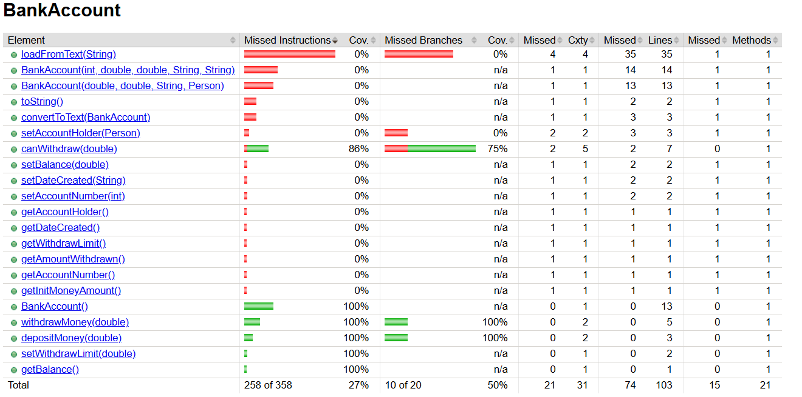

# Exercice 9

## État Initial

Après avoir exécuté `mvn clean test` et `mvn jacoco:report`, le rapport Jacoco montre que la classe `BankAccount` a une faible couverture (environ 27%).

Plusieurs méthodes sont complètement non couvertes (0%), notamment :

- `toString()`
- `convertToText(BankAccount)`
- `loadFromText(String)`

### Rapport Jacoco avant l'ajout des tests



## Tests Unitaires Ajoutés

On ajoute de nouveaux tests unitaires pour les méthodes non couvertes :

- Un test pour `toString()` vérifiant la présence des informations clés du compte
- Un test pour `convertToText()` s'assurant que le texte généré contient tous les champs attendus
- Un test pour `loadFromText()` exécutant la branche de gestion d'erreur avec un fichier invalide

Ces tests ont été ajoutés à `BankAccountTest.java`.

## Après l'Exécution des Tests

On execute les commandes suivantes à nouveau :

```bash
mvn clean test
mvn jacoco:report
```


On constate que la couverture de code a augmenté
